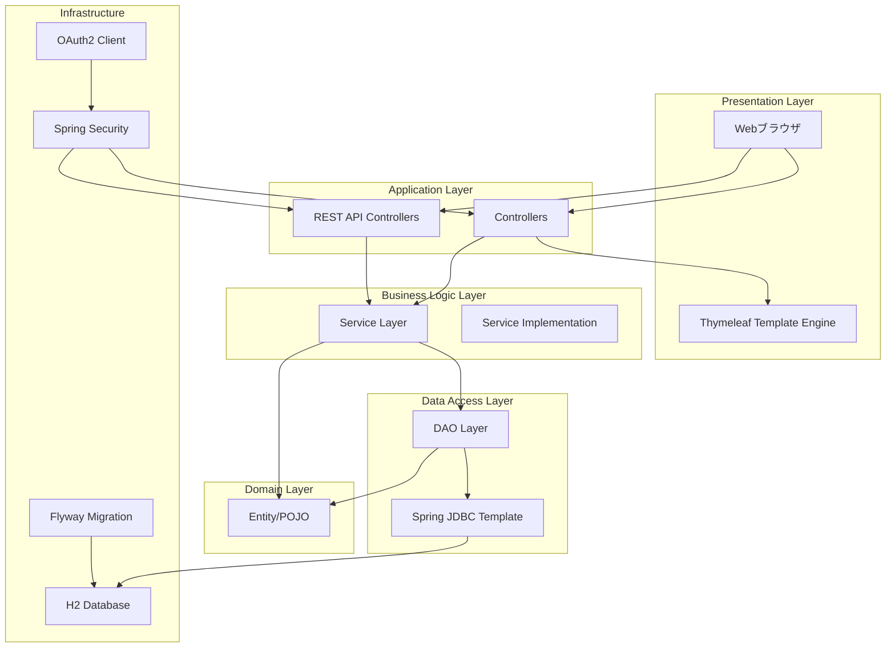
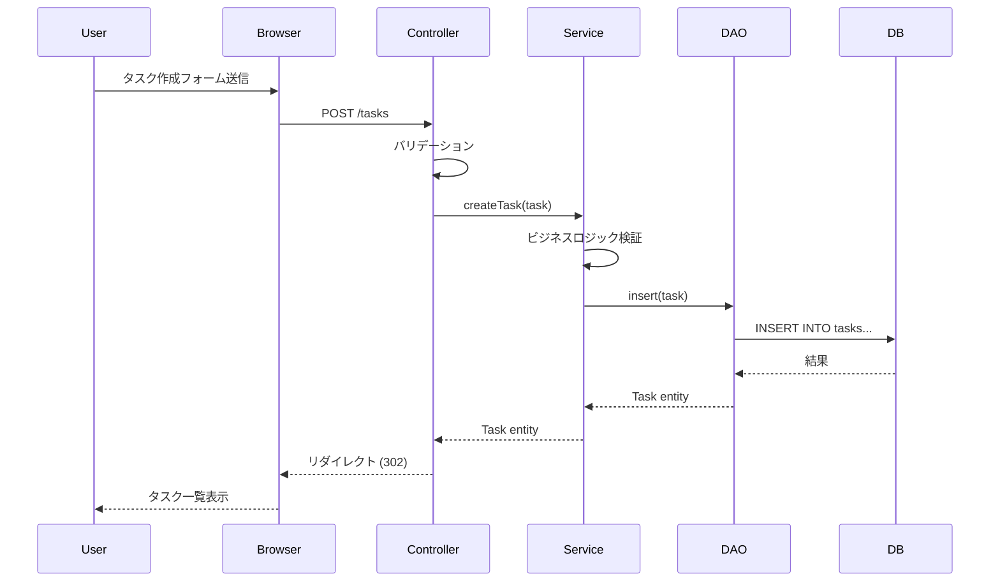
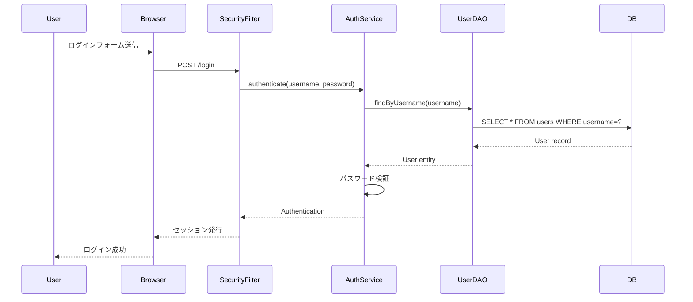
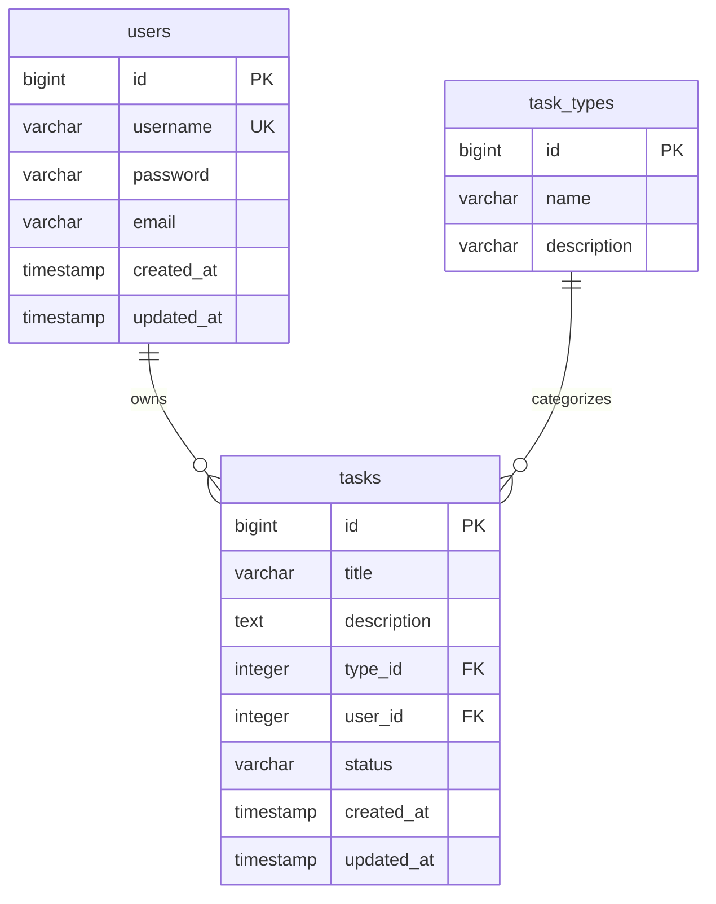

# アーキテクチャドキュメントの自動生成

プロジェクト全体を自動解析し、包括的なアーキテクチャドキュメントを生成します。

## 実装手順

### 1. プロジェクト構造の解析

```bash
# ディレクトリ構造の取得
ls -R src/main/java/com/example/demo/

# パッケージ構成の把握
Glob: pattern="src/main/java/**/*.java"
→ 全Javaファイルのパスからパッケージ構造を抽出
```

### 2. レイヤーごとのコンポーネント検出

```
# Entity層
Glob: pattern="**/entity/**/*.java"
Grep: pattern="@Entity|class.*\\{" path="src/main/java/com/example/demo/entity/"

# DAO層
Glob: pattern="**/dao/**/*.java"
Grep: pattern="@Repository|interface.*Dao"

# Service層
Glob: pattern="**/service/**/*.java"
Grep: pattern="@Service|interface.*Service"

# Controller層
Glob: pattern="**/controller/**/*.java" または "**/app/**/*Controller.java"
Grep: pattern="@RestController|@Controller"

# Configuration層
Glob: pattern="**/config/**/*.java"
Grep: pattern="@Configuration"
```

### 3. 設定ファイルの解析

```
# Spring Boot設定
Read: file_path="src/main/resources/application.yml"
Read: file_path="src/main/resources/application.properties"

# ビルド設定
Read: file_path="build.gradle"
Read: file_path="pom.xml"

# データベースマイグレーション
Glob: pattern="src/main/resources/db/migration/**/*.sql"
```

### 4. セキュリティ設定の確認

```
Grep: pattern="@EnableWebSecurity|SecurityFilterChain"
Grep: pattern="oauth2|formLogin|httpBasic"
```

### 5. 依存関係の抽出

```
# Gradle依存関係
Bash: ./gradlew dependencies --configuration runtimeClasspath
```

## 出力形式

Markdown形式で以下の構造：

```markdown
# WebToDoApp アーキテクチャドキュメント

## 1. システム概要

### プロジェクト名
WebToDoApp - タスク管理Webアプリケーション

### 目的
ユーザー認証機能を持つタスク管理システム。個人およびチームでのタスク管理を効率化する。

### 主要機能
- ユーザー認証（フォームログイン + OAuth2/Google）
- タスクのCRUD操作
- タスク種別による分類
- ユーザー管理

## 2. アーキテクチャ概要図



## 3. レイヤー構成

### 3.1 プロジェクト構造

```
src/main/java/com/example/demo/
├── app/                          # アプリケーション層
│   ├── TaskController.java       # タスク画面コントローラー
│   ├── UserController.java       # ユーザー画面コントローラー
│   ├── TaskApiController.java    # タスクREST API
│   └── AuthController.java       # 認証API
├── config/                       # 設定層
│   ├── SecurityConfig.java       # セキュリティ設定
│   ├── PasswordConfig.java       # パスワードエンコーダー設定
│   └── WebMvcConfig.java         # MVC設定
├── dao/                          # データアクセス層
│   ├── TaskDao.java              # タスクDAO インターフェース
│   ├── TaskDaoImpl.java          # タスクDAO 実装
│   ├── UserDao.java              # ユーザーDAO
│   └── TaskTypeDao.java          # タスク種別DAO
├── entity/                       # エンティティ層
│   ├── Task.java                 # タスクエンティティ
│   ├── User.java                 # ユーザーエンティティ
│   └── TaskType.java             # タスク種別エンティティ
└── service/                      # サービス層
    ├── TaskService.java          # タスクサービス インターフェース
    ├── TaskServiceImpl.java      # タスクサービス 実装
    └── UserAuthenticationService.java  # 認証サービス
```

### 3.2 各レイヤーの責務

#### Controller層 (app/)
- HTTPリクエストのハンドリング
- 入力バリデーション
- ビューへのデータ受け渡し
- REST APIのエンドポイント提供

#### Service層 (service/)
- ビジネスロジックの実装
- トランザクション管理
- 複数DAOの協調制御
- ドメインルールの実装

#### DAO層 (dao/)
- データベースアクセス
- SQL実行
- エンティティのマッピング
- CRUD操作の提供

#### Entity層 (entity/)
- ドメインモデルの定義
- データ構造の表現
- Plain Old Java Object (POJO)

#### Config層 (config/)
- Spring Beanの定義
- セキュリティ設定
- 外部サービス連携設定

## 4. データフロー

### 4.1 タスク作成フロー



### 4.2 認証フロー



## 5. 技術スタック

### バックエンド
| 技術 | バージョン | 用途 |
|------|-----------|------|
| Java | 11 | 開発言語 |
| Spring Boot | 2.7.18 | アプリケーションフレームワーク |
| Spring Security | 5.7.x | 認証・認可 |
| Spring JDBC | 5.3.x | データアクセス |
| Flyway | 9.x | DBマイグレーション |
| H2 Database | 2.x | インメモリDB |
| Thymeleaf | 3.0.x | テンプレートエンジン |
| Gradle | 7.6 | ビルドツール |

### フロントエンド
| 技術 | 用途 |
|------|------|
| HTML5 | マークアップ |
| CSS3 | スタイリング |
| JavaScript | クライアントサイドスクリプト |
| Thymeleaf | サーバーサイドレンダリング |

### 開発・テスト
| 技術 | 用途 |
|------|------|
| JUnit 5 | ユニットテスト |
| Mockito | モックフレームワーク |
| Spring Test | 統合テスト |

## 6. デザインパターン

### 6.1 採用パターン

#### Layered Architecture
- プレゼンテーション層、ビジネスロジック層、データアクセス層の明確な分離
- 単方向の依存関係（上位層→下位層）

#### DAO Pattern
- データアクセスロジックの抽象化
- インターフェースと実装の分離

#### Service Layer Pattern
- ビジネスロジックの集約
- トランザクション境界の明確化

#### Dependency Injection
- Spring DIコンテナによる依存性の注入
- 疎結合な設計

#### MVC Pattern
- Model-View-Controllerの分離
- Thymeleafによるビュー実装

## 7. セキュリティ設計

### 7.1 認証方式

#### フォームベース認証
- ユーザー名/パスワードによるログイン
- BCryptによるパスワードハッシュ化
- セッションベースの状態管理

#### OAuth2認証
- Google Sign-Inサポート
- Spring Security OAuth2 Client使用

### 7.2 認可設計

```java
// SecurityConfig.javaの設定例
http
    .authorizeRequests()
        .antMatchers("/login", "/oauth2/**").permitAll()
        .antMatchers("/api/**").authenticated()
        .anyRequest().authenticated()
    .and()
    .formLogin()
        .loginPage("/login")
        .defaultSuccessUrl("/tasks")
    .and()
    .oauth2Login()
        .defaultSuccessUrl("/tasks");
```

### 7.3 セキュリティ対策

| 脅威 | 対策 |
|------|------|
| CSRF | Spring SecurityのCSRFトークン |
| XSS | Thymeleafの自動エスケープ |
| SQLインジェクション | PreparedStatementの使用 |
| セッション固定攻撃 | セッション再生成 |
| パスワード漏洩 | BCryptハッシュ化 |

## 8. データベース設計

### 8.1 テーブル構成



### 8.2 マイグレーション管理

- Flywayによるバージョン管理
- マイグレーションファイル: `src/main/resources/db/migration/V*.sql`
- 起動時自動実行

## 9. インフラ構成

### 9.1 ローカル開発環境

```
┌─────────────────────────────────────┐
│   Developer Machine                 │
│                                     │
│  ┌──────────────────────────────┐  │
│  │  Spring Boot Application     │  │
│  │  (embedded Tomcat:8080)      │  │
│  └──────────────────────────────┘  │
│              │                      │
│              ↓                      │
│  ┌──────────────────────────────┐  │
│  │  H2 Database (in-memory)     │  │
│  │  Console: /h2-console        │  │
│  └──────────────────────────────┘  │
└─────────────────────────────────────┘
```

### 9.2 デプロイメント（想定）

```
┌─────────────┐
│   Client    │
└──────┬──────┘
       │ HTTPS
       ↓
┌─────────────────────────────┐
│   Load Balancer / Nginx     │
└──────────┬──────────────────┘
           │
    ┌──────┴──────┐
    ↓             ↓
┌────────┐   ┌────────┐
│ App #1 │   │ App #2 │
│ (8080) │   │ (8080) │
└────┬───┘   └────┬───┘
     │            │
     └──────┬─────┘
            ↓
   ┌─────────────────┐
   │   PostgreSQL    │
   │   (production)  │
   └─────────────────┘
```

## 10. 開発ガイドライン

### 10.1 コーディング規約
- Javaコーディング規約に準拠
- インデント: スペース4つ
- 命名規則: キャメルケース（変数/メソッド）、パスカルケース（クラス）

### 10.2 テスト戦略
- ユニットテスト: Service層、DAO層
- 統合テスト: Controller層
- カバレッジ目標: 80%以上

### 10.3 ブランチ戦略
- main: 本番環境
- develop: 開発環境
- feature/*: 機能開発
- bugfix/*: バグ修正

## 11. 今後の拡張方針

### 短期（1-3ヶ月）
- [ ] PostgreSQL本番環境対応
- [ ] RESTful API完全化
- [ ] フロントエンド分離（React/Vue.js）

### 中期（3-6ヶ月）
- [ ] マイクロサービス化検討
- [ ] タスク共有機能
- [ ] 通知機能（メール/プッシュ）

### 長期（6ヶ月以上）
- [ ] モバイルアプリ開発
- [ ] AI機能統合（タスク優先度自動判定）
- [ ] 多言語対応

## 付録

### A. 参考資料
- Spring Boot公式ドキュメント: https://spring.io/projects/spring-boot
- Spring Security公式ドキュメント: https://spring.io/projects/spring-security

### B. 用語集
| 用語 | 説明 |
|------|------|
| POJO | Plain Old Java Object - フレームワーク非依存のJavaオブジェクト |
| DAO | Data Access Object - データアクセスを抽象化するパターン |
| DTO | Data Transfer Object - レイヤー間でデータを転送するオブジェクト |
| DI | Dependency Injection - 依存性注入 |
```

## 実装時の注意事項

- すべてのパッケージとクラスを自動検出すること
- 実際のコードから設計パターンを推測すること
- build.gradleから正確な依存関係バージョンを取得すること
- データベーススキーマはFlywayマイグレーションファイルから生成すること
- セキュリティ設定は実際のSecurityConfigから抽出すること
- Mermaid図は実際のクラス構成を反映すること

## 出力ファイル

生成されたドキュメントは以下のパスに保存：

- `/docs/architecture.md` - アーキテクチャドキュメント
- `/docs/diagrams/` - 追加の図表（必要に応じて）
