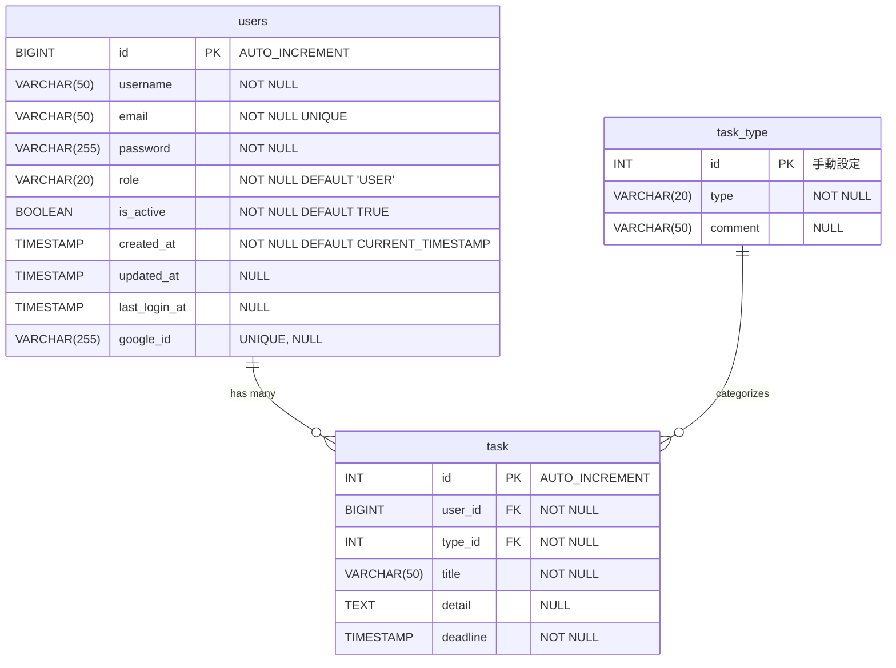

# 📊 WebToDoApp データベース設計書

**プロジェクト**: WebToDoApp（タスク管理システム）
**データベース**: PostgreSQL 14+ (本番) / H2 (開発・テスト)
**ORM**: Spring JDBC + JPA Annotations
**マイグレーションツール**: Flyway
**最終更新**: 2025-10-19

---

## 📋 目次

- [ER図](#er図)
- [テーブル一覧](#テーブル一覧)
- [テーブル定義詳細](#テーブル定義詳細)
  - [users テーブル](#users-テーブル)
  - [task_type テーブル](#task_type-テーブル)
  - [task テーブル](#task-テーブル)
- [リレーション詳細](#リレーション詳細)
- [インデックス一覧](#インデックス一覧)
- [マイグレーション履歴](#マイグレーション履歴)
- [データベース接続情報](#データベース接続情報)

---

## 🗺️ ER図



---

## 📊 テーブル一覧

| テーブル名 | 説明 | レコード数（初期） | 主な用途 |
|-----------|------|------------------|---------|
| **users** | ユーザー情報 | 1件（テストユーザー） | ログイン認証、タスク所有者管理 |
| **task_type** | タスク種別マスタ | 3件（優先度高/ー/優先度低） | タスク分類 |
| **task** | タスク情報 | 2件（サンプルタスク） | タスク管理の中核 |

---

## 📝 テーブル定義詳細

### users テーブル

**説明**: ユーザー情報を管理するテーブル。フォーム認証とOAuth2（Google）の両方に対応。

**物理名**: `users`
**論理名**: ユーザーテーブル

#### カラム定義

| カラム名 | 型 | NULL | デフォルト値 | 説明 | 制約 |
|---------|-----|------|-------------|------|------|
| **id** | BIGINT | ❌ | AUTO_INCREMENT | ユーザーID（主キー） | PRIMARY KEY |
| **username** | VARCHAR(50) | ❌ | - | ユーザー名 | NOT NULL |
| **email** | VARCHAR(50) | ❌ | - | メールアドレス | NOT NULL, UNIQUE |
| **password** | VARCHAR(255) | ❌ | - | パスワード（BCrypt暗号化） | NOT NULL |
| **role** | VARCHAR(20) | ❌ | 'USER' | ロール（USER, ADMIN, MODERATOR） | NOT NULL, DEFAULT 'USER' |
| **is_active** | BOOLEAN | ❌ | TRUE | アクティブフラグ | NOT NULL, DEFAULT TRUE |
| **created_at** | TIMESTAMP | ❌ | CURRENT_TIMESTAMP | 作成日時 | NOT NULL, DEFAULT CURRENT_TIMESTAMP |
| **updated_at** | TIMESTAMP | ✅ | NULL | 更新日時 | - |
| **last_login_at** | TIMESTAMP | ✅ | NULL | 最終ログイン日時 | - |
| **google_id** | VARCHAR(255) | ✅ | NULL | Google OAuth2 ID | UNIQUE (V4で追加) |

#### インデックス

| インデックス名 | 種類 | カラム | 用途 |
|--------------|------|--------|------|
| **PRIMARY** | PRIMARY KEY | id | 主キー |
| **users_email_key** | UNIQUE | email | メールアドレスの一意性保証 |
| **idx_users_google_id** | INDEX | google_id | Google IDによる高速検索（V4で追加） |

#### 制約

- **PRIMARY KEY**: `id`
- **UNIQUE**: `email`, `google_id`
- **NOT NULL**: `id`, `username`, `email`, `password`, `role`, `is_active`, `created_at`

#### サンプルデータ

```sql
INSERT INTO users (id, username, email, password, role, is_active, created_at, updated_at, last_login_at)
VALUES (1, 'test', 'test@example.com', 'test5417', 'USER', TRUE,
        TIMESTAMP '2020-07-07 15:00:00', TIMESTAMP '2020-07-07 15:00:00', TIMESTAMP '2020-07-07 15:00:00');
```

#### Entityクラス

**パス**: `src/main/java/com/example/demo/entity/User.java`

**アノテーション**:
- `@Entity`
- `@Table(name = "users")`
- `@Id`, `@GeneratedValue(strategy = GenerationType.IDENTITY)`
- `@PrePersist`, `@PreUpdate` - 自動的にcreated_at/updated_atを設定

---

### task_type テーブル

**説明**: タスク種別のマスタテーブル。優先度を表す固定値を管理。

**物理名**: `task_type`
**論理名**: タスク種別マスタ

#### カラム定義

| カラム名 | 型 | NULL | デフォルト値 | 説明 | 制約 |
|---------|-----|------|-------------|------|------|
| **id** | INT | ❌ | - | タスク種別ID（主キー） | PRIMARY KEY |
| **type** | VARCHAR(20) | ❌ | - | 種別名 | NOT NULL |
| **comment** | VARCHAR(50) | ✅ | NULL | コメント | - |

#### 制約

- **PRIMARY KEY**: `id`
- **NOT NULL**: `id`, `type`

#### マスタデータ

| id | type | comment |
|----|------|---------|
| 1 | 優先度高 | 最優先で取り掛かるべきタスク |
| 2 | ー | 期限に間に合わせるべきタスク |
| 3 | 優先度低 | 今後やってみたいアイデア |

```sql
INSERT INTO task_type (id, type, comment) VALUES
(1,'優先度高','最優先で取り掛かるべきタスク'),
(2,'ー','期限に間に合わせるべきタスク'),
(3,'優先度低','今後やってみたいアイデア');
```

#### Entityクラス

**パス**: `src/main/java/com/example/demo/entity/TaskType.java`

**アノテーション**:
- `@Entity`
- `@Table(name = "task_type")`
- `@Id` (※`@GeneratedValue`なし - 手動設定)

---

### task テーブル

**説明**: タスク情報を管理するテーブル。ユーザーとタスク種別に紐づく。

**物理名**: `task`
**論理名**: タスクテーブル

#### カラム定義

| カラム名 | 型 | NULL | デフォルト値 | 説明 | 制約 |
|---------|-----|------|-------------|------|------|
| **id** | SERIAL (INT) | ❌ | AUTO_INCREMENT | タスクID（主キー） | PRIMARY KEY |
| **user_id** | BIGINT | ❌ | - | ユーザーID（外部キー） | NOT NULL, FOREIGN KEY → users(id) |
| **type_id** | INT | ❌ | - | タスク種別ID（外部キー） | NOT NULL, FOREIGN KEY → task_type(id) |
| **title** | VARCHAR(50) | ❌ | - | タスク名 | NOT NULL |
| **detail** | TEXT | ✅ | NULL | タスク詳細 | - |
| **deadline** | TIMESTAMP | ❌ | - | 期限 | NOT NULL |

#### インデックス

| インデックス名 | 種類 | カラム | 用途 |
|--------------|------|--------|------|
| **PRIMARY** | PRIMARY KEY | id | 主キー |
| *(暗黙)* | INDEX | user_id | 外部キーによる自動インデックス |
| *(暗黙)* | INDEX | type_id | 外部キーによる自動インデックス |

#### 外部キー制約

| 制約名 | カラム | 参照先テーブル | 参照先カラム | ON DELETE | ON UPDATE |
|--------|--------|--------------|------------|-----------|-----------|
| **fk_task_user** | user_id | users | id | - | - |
| **fk_task_type** | type_id | task_type | id | - | - |

#### 制約

- **PRIMARY KEY**: `id`
- **FOREIGN KEY**: `user_id` → `users(id)`, `type_id` → `task_type(id)`
- **NOT NULL**: `id`, `user_id`, `type_id`, `title`, `deadline`

#### サンプルデータ

```sql
INSERT INTO task (user_id, type_id, title, detail, deadline) VALUES
(1, 1, 'JUnitを学習', 'テストの仕方を学習する', TIMESTAMP '2020-07-07 15:00:00'),
(1, 3, 'サービスの自作', 'マイクロサービスを作ってみる', TIMESTAMP '2020-09-13 17:00:00');
```

#### Entityクラス

**パス**: `src/main/java/com/example/demo/entity/Task.java`

**アノテーション**:
- `@Entity` (※テーブル名がクラス名と同じため@Tableは省略可能)
- `@Id`, `@GeneratedValue(strategy = GenerationType.IDENTITY)`
- `@ManyToOne`, `@JoinColumn(name = "type_id", insertable = false, updatable = false)` - TaskTypeとの関連

---

## 🔗 リレーション詳細

### 1. users ← task (1対多)

**関係**: 1人のユーザーは複数のタスクを持つ

**外部キー**: `task.user_id` → `users.id`

**制約名**: `fk_task_user`

**カーディナリティ**: 1 : N

**説明**:
- ユーザーが削除された場合、そのユーザーのタスクも削除される設計が望ましい（現在はON DELETE未設定）
- タスク作成時、必ず有効なuser_idを指定する必要がある

**SQL**:
```sql
ALTER TABLE task
ADD CONSTRAINT fk_task_user FOREIGN KEY (user_id) REFERENCES users(id);
```

---

### 2. task_type ← task (1対多)

**関係**: 1つのタスク種別は複数のタスクに使われる

**外部キー**: `task.type_id` → `task_type.id`

**制約名**: `fk_task_type`

**カーディナリティ**: 1 : N

**説明**:
- タスク種別はマスタデータのため、削除されることは想定していない
- V2マイグレーションでNULL値を1（優先度高）に埋めた後、V3でNOT NULL制約を追加

**SQL**:
```sql
ALTER TABLE task
ADD CONSTRAINT fk_task_type FOREIGN KEY (type_id) REFERENCES task_type(id);
```

---

## 🔍 インデックス一覧

| テーブル | インデックス名 | 種類 | カラム | 用途 |
|---------|--------------|------|--------|------|
| **users** | PRIMARY | PRIMARY KEY | id | 主キー検索 |
| **users** | users_email_key | UNIQUE | email | メールアドレス検索（ログイン） |
| **users** | idx_users_google_id | INDEX | google_id | Google ID検索（OAuth2ログイン） |
| **task_type** | PRIMARY | PRIMARY KEY | id | 主キー検索 |
| **task** | PRIMARY | PRIMARY KEY | id | 主キー検索 |
| **task** | *(暗黙)* | INDEX | user_id | ユーザー別タスク検索 |
| **task** | *(暗黙)* | INDEX | type_id | タスク種別検索 |

### パフォーマンス最適化のポイント

1. **users.email**: ログイン時に毎回使用されるため、UNIQUE制約により自動的にインデックスが作成される
2. **users.google_id**: V4で追加。OAuth2ログイン時の高速検索用
3. **task.user_id**: ユーザーごとのタスク一覧取得で頻繁に使用される
4. **task.type_id**: タスク種別によるフィルタリングで使用される

---

## 📜 マイグレーション履歴

### V1: 初期スキーマ作成 + シードデータ

**ファイル**: `V1__ensure_task_type_and_seed.sql`

**適用日**: 初回リリース時

**内容**:
- `users` テーブル作成
- `task_type` テーブル作成
- `task` テーブル作成（外部キー制約付き）
- task_type マスタデータ投入（3件）
- テストユーザー作成（id=1）
- サンプルタスク投入（2件）

**主な変更**:
```sql
CREATE TABLE users (
  id BIGSERIAL PRIMARY KEY,
  username VARCHAR(50) NOT NULL,
  email VARCHAR(50) NOT NULL UNIQUE,
  password VARCHAR(255) NOT NULL,
  role VARCHAR(20) NOT NULL DEFAULT 'USER',
  is_active BOOLEAN NOT NULL DEFAULT TRUE,
  created_at TIMESTAMP NOT NULL DEFAULT CURRENT_TIMESTAMP,
  updated_at TIMESTAMP,
  last_login_at TIMESTAMP
);

CREATE TABLE task_type (
  id INT NOT NULL,
  type VARCHAR(20) NOT NULL,
  comment VARCHAR(50),
  PRIMARY KEY (id)
);

CREATE TABLE task (
  id SERIAL PRIMARY KEY,
  user_id BIGINT NOT NULL,
  type_id INT NOT NULL,
  title VARCHAR(50) NOT NULL,
  detail TEXT,
  deadline TIMESTAMP NOT NULL,
  CONSTRAINT fk_task_user FOREIGN KEY (user_id) REFERENCES users(id),
  CONSTRAINT fk_task_type FOREIGN KEY (type_id) REFERENCES task_type(id)
);
```

---

### V2: task.type_id のNULL値埋め

**ファイル**: `V2__backfill_task_type.sql`

**適用日**: V3の前準備

**内容**:
- `task.type_id` がNULLのレコードを `1`（優先度高）に更新

**主な変更**:
```sql
UPDATE task SET type_id = 1 WHERE type_id IS NULL;
```

**理由**:
- V3でNOT NULL制約を追加するため、事前にNULL値を排除

---

### V3: task.type_id にNOT NULL制約追加

**ファイル**: `V3__add_notnull_and_fk.sql`

**適用日**: V2の直後

**内容**:
- `task.type_id` にNOT NULL制約を追加

**主な変更**:
```sql
ALTER TABLE task ALTER COLUMN type_id SET NOT NULL;
```

**理由**:
- すべてのタスクに必ずタスク種別を持たせる仕様に変更

---

### V4: Google ID カラム追加

**ファイル**: `V4__add_google_id_column.sql`

**適用日**: OAuth2対応時

**内容**:
- `users.google_id` カラム追加（VARCHAR(255), UNIQUE）
- `idx_users_google_id` インデックス追加

**主な変更**:
```sql
ALTER TABLE users ADD COLUMN google_id VARCHAR(255);
CREATE INDEX idx_users_google_id ON users(google_id);
```

**理由**:
- Google OAuth2認証に対応するため、Google IDを保存する必要がある

---

## 🔌 データベース接続情報

### 本番環境（PostgreSQL）

```yaml
spring:
  datasource:
    url: jdbc:postgresql://localhost:5432/webtodoapp
    username: postgres
    password: [設定値]
    driver-class-name: org.postgresql.Driver
  jpa:
    database-platform: org.hibernate.dialect.PostgreSQLDialect
    hibernate:
      ddl-auto: none  # Flywayが管理するため無効化
  flyway:
    enabled: true
    locations: classpath:db/migration
    baseline-on-migrate: true
```

---

### 開発・テスト環境（H2）

```yaml
spring:
  datasource:
    url: jdbc:h2:mem:test;MODE=PostgreSQL;DATABASE_TO_UPPER=false;DB_CLOSE_DELAY=-1
    username: sa
    password:
    driver-class-name: org.h2.Driver
  h2:
    console:
      enabled: true
      path: /h2-console
  jpa:
    database-platform: org.hibernate.dialect.H2Dialect
    hibernate:
      ddl-auto: none
  flyway:
    enabled: true
```

**H2コンソールアクセス**:
- URL: http://localhost:8080/h2-console
- JDBC URL: `jdbc:h2:mem:test`
- Username: `sa`
- Password: (空白)

---

## 📋 データベース設計方針

### 1. 命名規則

- **テーブル名**: 小文字、単数形または複数形（usersは複数形、taskは単数形）
- **カラム名**: スネークケース（snake_case）
- **外部キー制約名**: `fk_[テーブル名]_[参照先]` 形式
- **インデックス名**: `idx_[テーブル名]_[カラム名]` 形式

### 2. 主キー戦略

- **users.id**: BIGSERIAL（BIGINT AUTO_INCREMENT） - 大量ユーザーを想定
- **task.id**: SERIAL（INT AUTO_INCREMENT） - 通常の自動採番
- **task_type.id**: INT（手動設定） - マスタデータのため固定値

### 3. 日時管理

- **作成日時**: `created_at` (TIMESTAMP NOT NULL DEFAULT CURRENT_TIMESTAMP)
- **更新日時**: `updated_at` (TIMESTAMP NULL) - @PreUpdateで自動更新
- **最終ログイン**: `last_login_at` (TIMESTAMP NULL)

### 4. 論理削除 vs 物理削除

- **現在**: 物理削除（DELETE文）
- **推奨**: `is_active` フラグを使った論理削除（usersテーブルには既に実装済み）

### 5. PostgreSQL固有の型

- **BIGSERIAL**: PostgreSQLのAUTO_INCREMENT型（BIGINT）
- **SERIAL**: PostgreSQLのAUTO_INCREMENT型（INT）
- **TIMESTAMP**: 日時型（TIMEZONEなし）
- **BOOLEAN**: 真偽値型

---

## 🚀 今後の拡張予定

### 1. タスクステータス管理

**提案**: `task.status` カラム追加
```sql
ALTER TABLE task ADD COLUMN status VARCHAR(20) NOT NULL DEFAULT 'TODO';
-- 例: TODO, IN_PROGRESS, DONE, CANCELLED
```

### 2. タスク優先度

**提案**: `task.priority` カラム追加
```sql
ALTER TABLE task ADD COLUMN priority INT NOT NULL DEFAULT 0;
-- 例: 0=低, 1=中, 2=高, 3=最優先
```

### 3. タスクタグ機能

**提案**: 多対多リレーションの導入
```sql
CREATE TABLE tag (
  id SERIAL PRIMARY KEY,
  name VARCHAR(50) NOT NULL UNIQUE
);

CREATE TABLE task_tag (
  task_id INT NOT NULL,
  tag_id INT NOT NULL,
  PRIMARY KEY (task_id, tag_id),
  FOREIGN KEY (task_id) REFERENCES task(id) ON DELETE CASCADE,
  FOREIGN KEY (tag_id) REFERENCES tag(id) ON DELETE CASCADE
);
```

### 4. タスクコメント機能

**提案**: `task_comment` テーブル追加
```sql
CREATE TABLE task_comment (
  id BIGSERIAL PRIMARY KEY,
  task_id INT NOT NULL,
  user_id BIGINT NOT NULL,
  comment TEXT NOT NULL,
  created_at TIMESTAMP NOT NULL DEFAULT CURRENT_TIMESTAMP,
  FOREIGN KEY (task_id) REFERENCES task(id) ON DELETE CASCADE,
  FOREIGN KEY (user_id) REFERENCES users(id)
);
```

### 5. 論理削除の完全対応

**提案**: taskテーブルに `deleted_at` カラム追加
```sql
ALTER TABLE task ADD COLUMN deleted_at TIMESTAMP NULL;
CREATE INDEX idx_task_deleted_at ON task(deleted_at);
```

---

## 📊 統計情報

### テーブルサイズ見積もり（1年後）

| テーブル | 想定レコード数 | 平均行サイズ | 推定サイズ |
|---------|--------------|------------|----------|
| users | 1,000件 | ~200 bytes | ~200 KB |
| task_type | 3件（固定） | ~50 bytes | ~150 bytes |
| task | 50,000件 | ~150 bytes | ~7.5 MB |
| **合計** | - | - | **~8 MB** |

### インデックスサイズ見積もり

- **users**: 主キー + email + google_id = ~50 KB
- **task**: 主キー + user_id + type_id = ~500 KB
- **合計**: ~550 KB

---

## 🔒 セキュリティ考慮事項

1. **パスワード暗号化**: BCryptPasswordEncoderを使用（Springで自動処理）
2. **SQLインジェクション対策**: Spring JDBCのPreparedStatementを使用
3. **機密情報の保護**: passwordカラムはAPI応答で除外すること（DTOで制御）
4. **Google ID管理**: google_idはUNIQUE制約により重複を防止

---

## 📚 参考リソース

- **Flywayマイグレーションファイル**: `src/main/resources/db/migration/`
- **Entityクラス**: `src/main/java/com/example/demo/entity/`
- **DAOクラス**: `src/main/java/com/example/demo/dao/`
- **PostgreSQL公式ドキュメント**: https://www.postgresql.org/docs/14/
- **H2データベース公式**: https://www.h2database.com/

---

**作成者**: Claude Code
**作成日**: 2025-10-19
**バージョン**: 1.0.0
